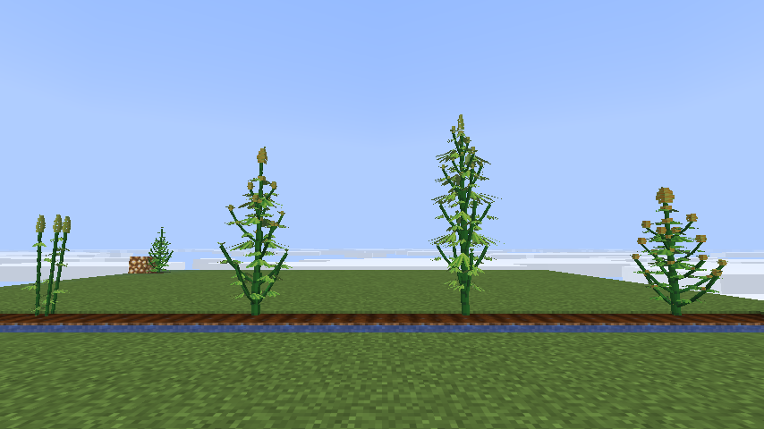
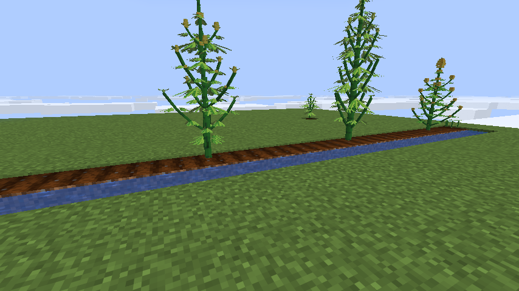
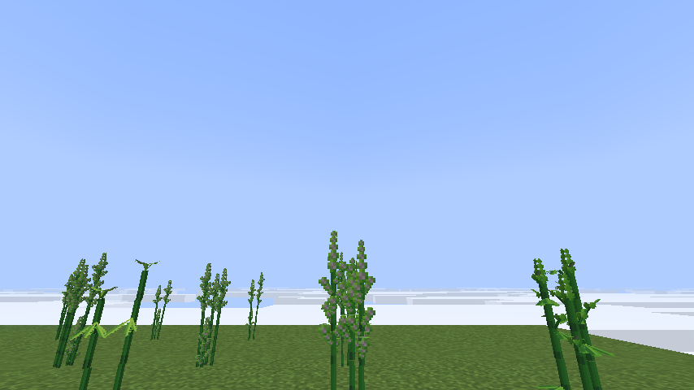
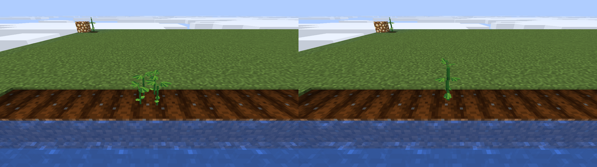
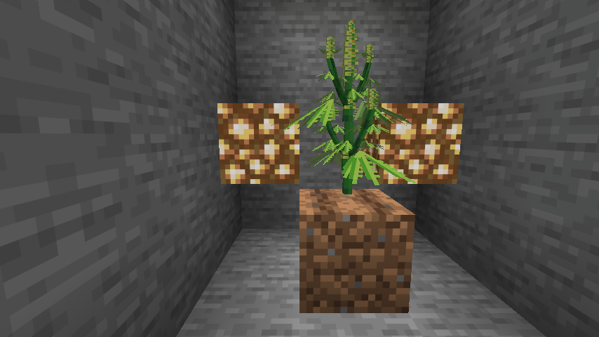
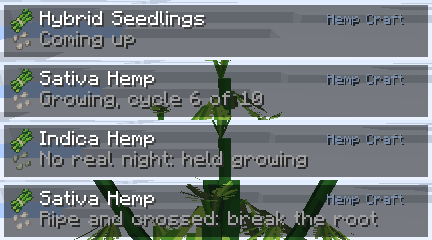

# Hemp Craft

A Minecraft Fabric mod that adds hemp as a plant you grow, shape and breed: let it grow wild for
fibre and seed, or learn the growers' knack that turns a clump of seedlings into a single branching
indica, sativa or hybrid, raised through its days and nights to full size.

## Screenshots

## The Three Strains

**Indica** is short and bushy. Its nodes crowd close, its branches spread wide, its leaves are
broad and dark, and its buds dense.

**Sativa** is tall and lanky. It grows faster, stretches far more once it flowers, and climbs with
long steep branches, narrow pale leaves and long airy buds.

**Hybrid** sits between them. It first comes of indica and sativa flowering together; after that,
any plant crossed with it gives hybrid seed too.

## Finding Seed

**Wild hemp** grows in patches on grass: indica in meadows, cherry groves and windswept hills and
forests; sativa in plains, sunflower plains, savannas and sparse jungle. Breaking it gives two or
three hemp and a seed of its strain, sometimes two.

**Wandering traders** sometimes carry indica or sativa seeds (one emerald each) or a bundle of three
hemp (one emerald). They sit in the trader's common pool, so not every trader has them.

## Growing It

**Planting.** Seeds on farmland come up as a clump of seedlings. Left to itself, a clump grows
lanky, the way hemp grows wild: a tangle of thin stems in its strain's manner (indica's low and
crowded, sativa's tall and whippy, two blocks high) that flowers small and seedy, in sprigs of pods
up the tops of its stems. At the last stage the pods explode into growth.

The tall branching plants in the screenshots are not grown that way. Growers who raise them do
something to the clump while it is young, and the window is short. What they do, they keep to
themselves.

**Light and dark.** A plant counts its age in cycles, each a spell of real light followed by a spell
of real darkness, a minute or more of each. A natural day and night make one cycle. Ten cycles of
growth, and it flowers for five more.

- Light is the sun, or a lamp: a plant in an underground room under lamps gets its days.
- Dark is an open night, or a room with the lamps off. Some light at night is fine: a torch four
  blocks off, or a lamp five, still leaves the plant its night. Any nearer spoils it, and that
  cycle does not count.
- So a plant kept lit at night never flowers. It goes on growing on its light alone: steadily for
  the first ten days' worth, then slower and slower, as big as you have the patience for. Lamps on a
  daylight sensor let you choose when it flips.
- A lamp on a fast timer makes a cycle every couple of minutes. That forces a plant into flower
  while it is still small: a quick, short plant with a small crop, where a natural season grows a
  big one.
- Sleeping through the night counts as the night. Time the plant's chunk spent unloaded does not.
  A plant grows under lamps whether or not the world's day moves.

**Flowering.** The first day and a half the plant stretches, sativa most of all. Then buds set,
small and spiky, and form and fill out over the rest of the five days while the plant keeps
growing slowly. Late in flower it drops its lowest leaves.

**Shape.** Every single-stalked plant grows its own shape from its seed: a main stalk tapering to
its tip, leaves in opposite pairs each turned a quarter from the last, and a branch from every
leaf's joint, angled out and curling up, longest at the bottom and none at the tip, so the plant
fills out into a cone as it gains height. Every branch flowers at its tip. Branches spread about a
block each way on a grown plant, so plant them a few apart to see each one whole; only the stalk
itself needs the space above it clear.

**Pruning.** Cut a piece off a plant and it stays cut; the plant does not grow it back.

**Bone meal.** Use it on any part of a plant to hurry it along: a day's growth while it is growing,
a day of flowering once it flowers. It never flips a plant into flower; only nights do that. A ripe
plant, or a clump gone to seed, takes no more.

## Harvest and Breeding

Break a plant's root, the block on the farmland, to harvest all of it. What it gives depends on how
it was grown.

**A clump grown lanky** is the fibre and seed crop, and that is all it is. Its raw hemp, the fibre
for string and paper, peaks the stage before it goes to seed, while its pods are still small: that
is the most fibre hemp gives. Let it go to seed and the fibre falls away, but it gives seed by the
handful. It never gives a flower.

**A single stalk** gives a little fibre from the stalk, seed only rarely, and flowers of its own
strain: as many as its size and ripeness carry, a forced small plant a few and a full season's many.

**Wild hemp** gives a little fibre and a seed or two of its strain, and no flower: a patch on a
hillside has had nobody near it. Any plant cut before it flowered gives back the seed it came from.

A plant that flowers within twelve blocks of another strain in flower at the same time catches its
pollen, and half the seed it drops is hybrid: an indica beside a sativa, or either beside a hybrid.
Hybrid seed breeds hybrid, whatever it grew beside.

Hemp seeds feed chickens and parrots, and seeds and hemp both go in a composter.

## On the Block Tip

With [block-tip](https://github.com/fatlard1993/block-tip) installed, looking at any piece of a plant
names its strain and says where it is: which cycle it is on, which day of flowering, whether it
has caught another strain's pollen, when it is at its most fibre, when it has gone to seed, and when
it is ripe. A plant that has gone two days without a real night says so, which is how you find the
lamp keeping it from flowering.

## Crafting

| Ingredients | Result |
|---|---|
| 4 hemp, in a square | 3 paper |
| 3 hemp, in a row | 2 string |
| 8 hemp, in a ring | a lead |
| 6 hemp, two by three | 3 rope |

The paper square fits the inventory's own crafting grid; the rest need a crafting table. They all
unlock the first time you hold hemp.

**Rope** hangs from whatever is above it, one thick braided cord down the middle of the block. You
walk through it and you climb it, so a coil dropped down a shaft is a way back up. It hangs the way
a chain does: from a solid face or from the rope above, and it comes down when its anchor does.

## Where It Grows Wild

The biomes are the tags `hemp-craft-justfatlard:grows_wild_indica` and `grows_wild_sativa`. A
datapack can write `data/hemp-craft-justfatlard/tags/worldgen/biome/grows_wild_<strain>.json` to add
biomes, another mod's included; with `"replace": true` its list replaces this one instead of joining
it. The change applies from the next server start, in chunks generated after it.

## Pandorical

Hemp Craft runs server-side, and Pandorical is required: the server will not load this mod without it.
Every piece of the plant and every item is mirrored into Pandorical's content registry, and their
textures and models arrive through Pandorical's content sync, so a player needs Pandorical on their
client to join.

## Development

Installing, how a plant is modelled, and the art pipeline are in [DEVELOPMENT.md](DEVELOPMENT.md).

## License

MIT, see [LICENSE](LICENSE).
